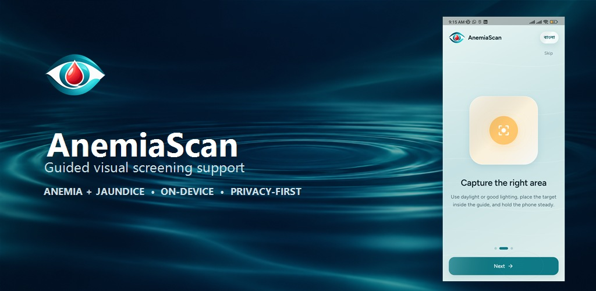
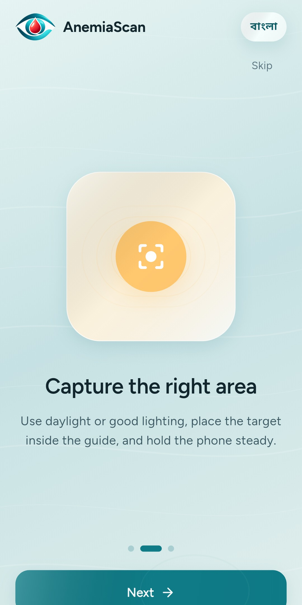
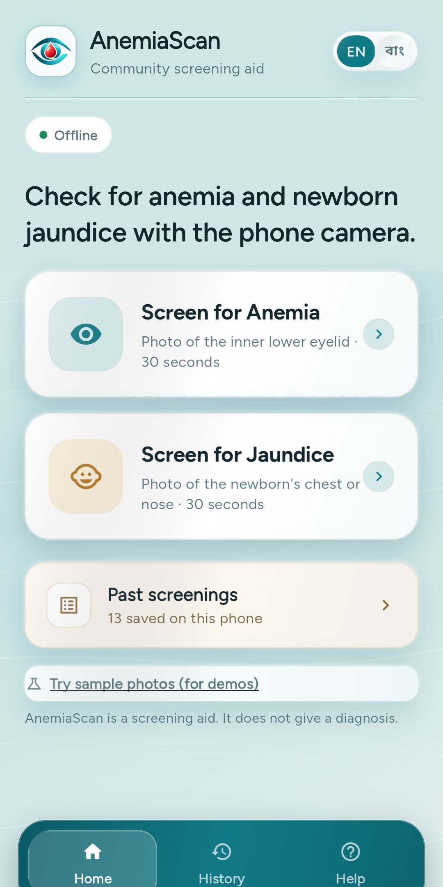
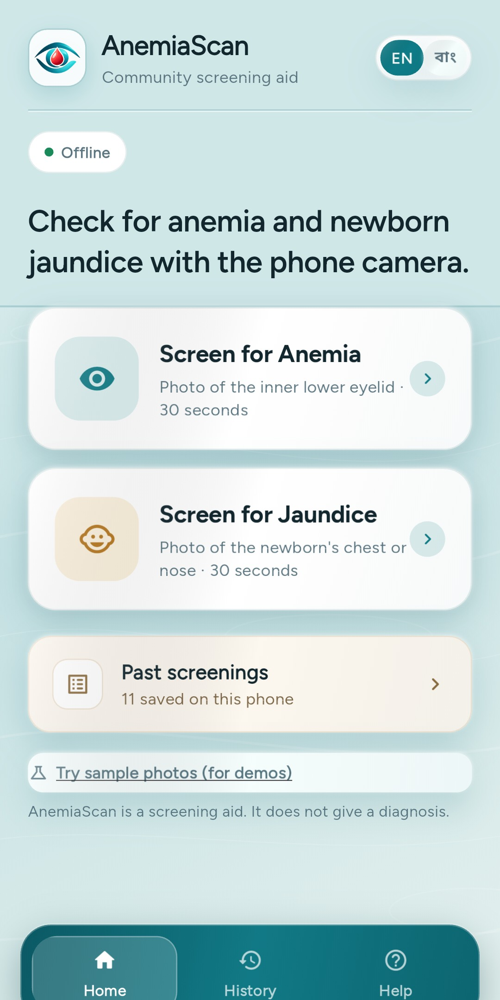

# AnemiaScan

> A privacy-first Flutter app that supports **non-diagnostic visual screening** for anemia and jaundice through guided phone-camera capture.

AnemiaScan helps users take more consistent eye or skin photographs, checks whether a capture is usable, and presents a cautious colour-signal result. It runs entirely on-device and retains screening history locally.

## Important medical notice

**This app is not a diagnostic device and does not measure haemoglobin or bilirubin.** Results are visual-screening signals only, not disease probabilities or laboratory values. A low, moderate, or high result must be confirmed by a qualified clinician and appropriate blood testing. Do not use this app for emergency decisions or to delay care.

## Features

- Guided camera capture for palpebral-conjunctiva (anemia) and skin (jaundice) modes
- Image-quality and anatomy checks that reject unsuitable photos instead of assigning a result
- On-device CIE Lab colour-signal analysis with conservative confidence ceilings
- Clear low / moderate / high screening bands and next-step guidance
- Local, privacy-preserving screening history — no backend required
- Bengali and English interface support
- Built-in sample images for demos and regression testing

## How it works

1. Select anemia or jaundice screening.
2. Follow the framing and lighting guidance to capture or choose a photo.
3. The app validates exposure, colour cast, texture, and relevant anatomy.
4. For accepted images, it calculates a mode-specific colour signal and displays a **screening** band with capture confidence.

The confidence score reflects capture quality and distance from a colour threshold; it is **not** the likelihood that someone has anemia or jaundice.

## App preview

<p align="center">
  
</p>

<p align="center">
  
  
  
</p>

## Tech stack

- Flutter / Dart
- `camera` and `image_picker` for image acquisition
- `image` for on-device image processing
- Hive for local persistence
- Google Fonts and Audioplayers for the UI experience

## Getting started

### Prerequisites

- Flutter SDK compatible with Dart `^3.9.2`
- An Android or iOS device/emulator with camera access for live capture

### Run locally

```bash
git clone https://github.com/irfanAbir1231/AnemiaScan.git
cd AnemiaScan
flutter pub get
flutter run
```

### Test

```bash
flutter test
```

## Validation and limitations

The project includes bundled reference images and automated checks for input rejection, tier rendering, confidence bounds, and the absence of fabricated laboratory values. The evidence audit and known limitations are documented in [CV_VALIDATION.md](CV_VALIDATION.md).

Clinical performance claims require a prospective study with paired laboratory measurements, independent training/testing cohorts, and reported sensitivity, specificity, ROC-AUC, calibration, and subgroup results.

## Privacy

Photos and screening history stay on the device. This repository contains no backend service and the app does not require an account.

## Repository notes

Android signing keys, credentials, build output, and installable APKs are intentionally excluded from version control. Publish signed builds through GitHub Releases.

## License

No license has been selected yet. All rights reserved until a license is added.